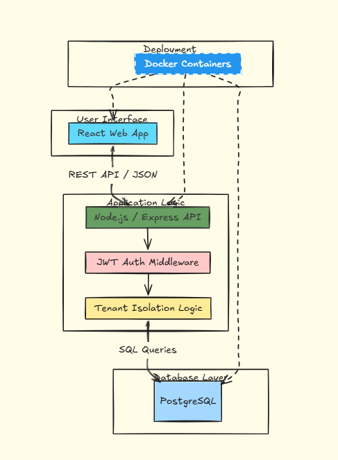
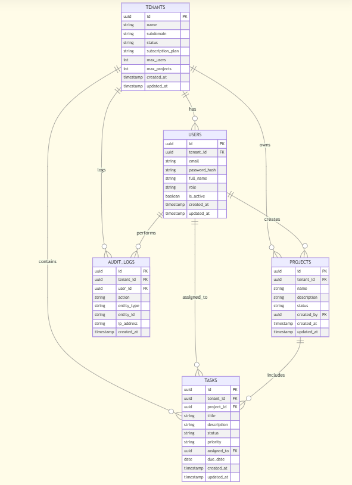

# Research & System Design: Multi-Tenant Project Management Platform

## 1. Introduction
This project focuses on building a **SaaS (Software as a Service)** platform. The goal is to allow multiple different companies (called **Tenants**) to use the same software while keeping their data completely private from one another. 

Imagine an apartment building: everyone shares the same foundation and plumbing, but every tenant has their own key to their own private apartment.

---

## 2. Multi-Tenancy Architecture
We evaluated three ways to store data for multiple companies:

1.  **Shared Database & Shared Schema (The "One Big Room" approach):** Everyone is in one database. We use a `tenant_id` (a company ID tag) on every row of data to keep things separate.
2.  **Separate Schema (The "Private Drawers" approach):** One database, but each company gets its own private set of tables.
3.  **Separate Database (The "Private Buildings" approach):** Every company gets its own physical database.

### The Chosen Path
We chose the **Shared Database & Shared Schema** model because it is the most cost-effective, easiest to manage with Docker, and scales perfectly for a startup-sized platform.

---

## 3. System Architecture
The system follows a "Three-Tier" design, separating the user interface from the business logic and the data storage.

### 3.1 Architecture Diagram
This diagram shows how the user interacts with the system through a secure bridge.

---

## 4. Database Design (ERD)
To ensure privacy, the `tenant_id` is the most important part of our database. It acts as a "security tag" that the system checks before showing any data.

### 4.1 Entity Relationship Diagram (ERD)
This blueprint shows how all tables (Users, Projects, and Tasks) are connected back to a specific Tenant.

---

## 5. Technology Stack
* **Frontend:** React.js (For a smooth, modern user experience).
* **Backend:** Node.js & Express (For fast, scalable API handling).
* **Database:** PostgreSQL (For reliable, structured data storage).
* **Security:** JWT (JSON Web Tokens) for secure, "badge-based" entry.
* **Deployment:** Docker & Docker Compose (To ensure the app runs the same on every machine).

---

## 6. Security & Privacy Rules
1.  **Isolation:** Every database query must include `WHERE tenant_id = current_tenant`.
2.  **Encryption:** Passwords are never stored as plain text; they are scrambled using `bcrypt`.
3.  **Access Control:** Users are assigned roles (Super Admin, Tenant Admin, or User) to limit what they can click on.
4.  **Audit Logs:** The system records who did what and when, so we have a clear history of actions.

---

## 7. Conclusion
By using a shared database and a "Three-Tier" architecture, we have designed a platform that is affordable to run but strong enough to keep every company's data safe. This setup is perfect for growing a SaaS product from zero to thousands of users.